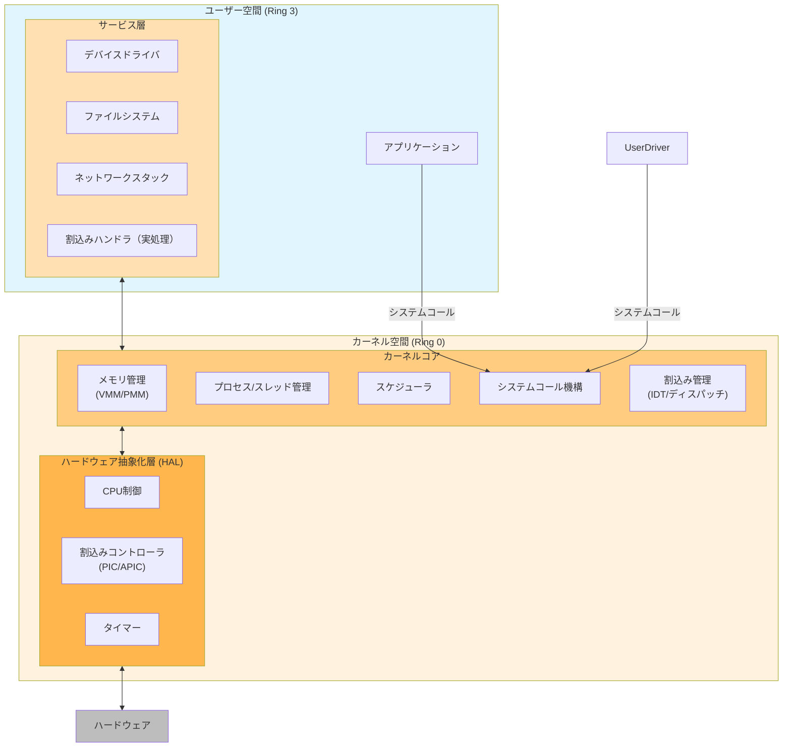

# SwiftCore アーキテクチャ設計

ハイブリッドカーネル

### 設計

- **コア機能**: カーネル空間で高速実行（Ring 0）
- **拡張機能**: モジュール化して柔軟性を確保
- **デバイスドライバ**: 一部をユーザー空間で動作可能に

## レイヤー構造

```mermaid
graph TB
    subgraph UserSpace["ユーザー空間 (Ring 3)"]
        App["アプリケーション"]
        subgraph ServiceLayer["サービス層"]
            DeviceDriver["デバイスドライバ"]
            FileSystem["ファイルシステム"]
            Network["ネットワークスタック"]
            IntHandler["割込みハンドラ（実処理）"]
        end
    end

    subgraph KernelSpace["カーネル空間 (Ring 0)"]


        subgraph KernelCore["カーネルコア"]
            Memory["メモリ管理<br/>(VMM/PMM)"]
            Process["プロセス/スレッド管理"]
            Scheduler["スケジューラ"]
            Syscall["システムコール機構"]
            IntMgmt["割込み管理<br/>(IDT/ディスパッチ)"]
        end

        subgraph HAL["ハードウェア抽象化層 (HAL)"]
            CPU["CPU制御"]
            IntCtrl["割込みコントローラ<br/>(PIC/APIC)"]
            Timer["タイマー"]
        end
    end

    Hardware["ハードウェア"]

    App --> |システムコール| Syscall
    UserDriver --> |システムコール| Syscall

    ServiceLayer <--> KernelCore
    KernelCore <--> HAL
    HAL <--> Hardware

    style UserSpace fill:#e1f5ff
    style KernelSpace fill:#fff3e0
    style ServiceLayer fill:#ffe0b2
    style KernelCore fill:#ffcc80
    style HAL fill:#ffb74d
    style Hardware fill:#bdbdbd
```
